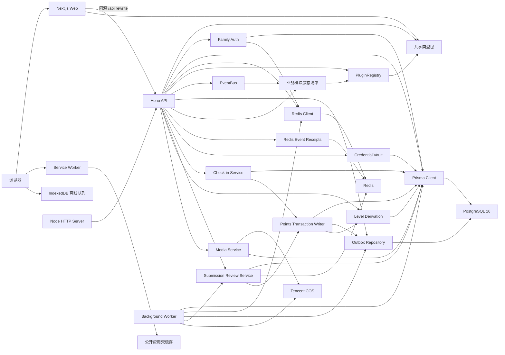
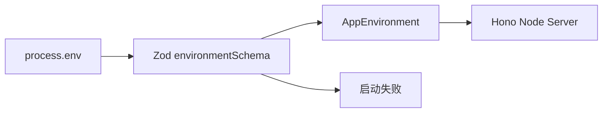
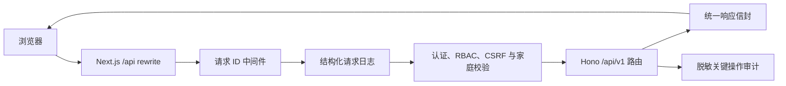

# FamilyStar 系统架构

## 概述

FamilyStar 是面向有孩子家庭的成长管理 Web 应用，围绕任务打卡、积分、等级和奖励形成激励闭环。Phase 1 的 12 个阶段及真实运行缺陷修复任务 13、14、15 已完成，产品补全阶段 12 已交付 PWA 应用壳与离线打卡恢复。家庭身份、任务打卡、媒体审核、积分等级、奖励闭环、双端响应式页面、集中安全边界、后台运行时和自动化质量门禁均已实现。

浏览器界面由 Next.js 14 App Router 提供。REST API 使用 Hono 并通过 `@hono/node-server` 运行在 Node.js 上。跨应用类型从 `@familystar/shared` 导入，减少 Web 与 API 之间的契约漂移。

家长端九页面和孩子端六页面已完成。独立 Worker、Docker 多阶段构建和开发/生产 Compose 编排已完成。开发 Web 已通过 Next.js rewrite 转发同源 API。

## 技术栈

| 类别 | 当前实现 |
|---|---|
| 运行时 | Node.js 20.9 或更高版本 |
| 语言 | TypeScript 5.9.3 |
| 包管理 | pnpm 11.18.0 workspace |
| Web | Next.js 14.2.35、React 18.3.1、App Router |
| Web 样式 | Tailwind CSS 3.4.17、PostCSS 8.5.6、Autoprefixer 10.4.21 |
| Web 视觉 | FamilyStar Design Tokens、Fredoka、Nunito、Lucide React 0.547.0 |
| API | Hono 4.12.32、`@hono/node-server` 2.0.12 |
| 配置校验 | Zod 4.4.3 |
| 单元测试 | Vitest 3.2.4、V8 coverage |
| 代码质量 | TypeScript strict、ESLint 8.57.1、Prettier 3.9.6 |
| 数据库 | PostgreSQL 16、Prisma ORM/Client 6.19.2、顺序 SQL 迁移历史 |
| Redis | Redis Node.js Client 6.1.0、惰性连接、隔离键空间、Lua 原子操作 |
| 插件内核 | 静态 PluginRegistry、五模块编译期清单、不可变 manifest、依赖顺序与权限许可清单 |
| 事件基础设施 | 命名空间 EventBus、JSONB 事件信封、事务 Outbox、租约 claim、有界重试与 Redis receipt |
| 后台运行时 | 独立 Worker、五类周期作业、Redis 调度锁、数据库运行记录、退避重试和健康端点 |
| 容器运行时 | Web/API/Worker 多阶段镜像、PostgreSQL 16、Redis、迁移服务和双环境 Compose |
| 凭证保险库 | Node.js Crypto AES-256-GCM、每记录数据密钥、版本化主密钥与 Prisma 重包裹适配器 |
| 身份认证 | 家庭码统一入口、bcrypt.js cost 12、双家长邀请、孩子 PIN/密码、5 次失败锁定、10 次/15 分钟限流、Redis 滚动会话与主体撤销 |
| 对象存储 | 已决定使用家庭级腾讯云 COS，任务 5 实现 |

## 项目结构

```text
FamilyStar/
├── apps/
│   ├── web/                 # Next.js App Router 前端
│   └── api/                 # Hono REST API、独立 Worker、Prisma Schema 与迁移
├── packages/
│   └── shared/              # 跨工作区共享 TypeScript 类型与插件契约
├── modules/                 # 业务模块组合根、静态清单与开关占位
│   ├── tasks/               # 任务模块包
│   ├── check-in/            # 打卡模块包
│   ├── points/              # 积分模块包
│   ├── levels/              # 等级模块包
│   └── rewards/             # 奖励模块包
├── .monkeycode/
│   ├── docs/                # 项目文档
│   └── specs/               # 决策与实施任务
├── package.json             # 根级脚本和运行时要求
├── Dockerfile               # Web、API 和 Worker 多阶段镜像
├── compose.dev.yml          # 开发环境编排，公开 8098
├── compose.prod.yml         # 生产环境编排，公开 8099
├── tsconfig.base.json       # 全工作区严格 TypeScript 基线
├── .eslintrc.cjs            # 通用静态检查配置
├── .prettierrc.json         # 统一格式规则
├── .env.example             # 非敏感环境变量示例
├── pnpm-workspace.yaml      # 工作区与依赖脚本许可
└── pnpm-lock.yaml           # 确定性依赖锁文件
```

## 子系统

### Web 应用

- 位置：`apps/web/`
- 入口：`app/layout.tsx`、`app/page.tsx`
- 样式入口：`app/globals.css`、`tailwind.config.cjs`。
- 职责：提供统一家庭登录入口、浏览器页面、元数据、品牌字体、视觉 Token、家长端九路由和孩子端六路由。
- 当前依赖：React、Next.js、Tailwind CSS、Lucide React、`@familystar/shared`。
- 响应式边界：mobile 小于 768px，tablet 为 768px 至 1024px，desktop 大于 1024px。
- PWA 壳：`app/manifest.ts`、`app/offline/route.ts`、`public/sw.js` 与 `components/service-worker-registration.tsx` 提供安装清单、离线回退和生产安全上下文注册。
- 离线打卡：`lib/check-in-submission.ts`、`offline-check-in-repository.ts` 与 `offline-check-in-runner.ts` 保存 TICK/TEXT 请求和媒体 Blob，并在身份确认后恢复提交。

### PWA 与离线恢复

- Service Worker 预缓存版本化根壳、离线页、manifest 与图标，只管理 `familystar-pwa-` 前缀缓存；导航采用 network-first 并在网络失败时返回 `/offline`。
- 同源 `/_next/static/` 使用 cache-first，其余公开静态资源使用 stale-while-revalidate。缓存请求省略 Cookie，仅保留 `Accept`；API、认证、私有、跨源、授权、非 GET 请求及带 `private`、`no-store`、`Set-Cookie` 的响应绕过缓存。
- 浏览器数据库 `familystar-offline` 当前版本为 2，包含 `check-in-queue` 与 `media-drafts`。普通记录保存原打卡幂等键；媒体记录保存 Blob、上传幂等键、打卡幂等键及已上传媒体 ID。
- 每条记录绑定 `{ familyId, childId }` owner。页面仅展示当前 owner 数据，仓储的 claim、重试、删除和媒体更新再次校验 owner；v2 之前无 owner 的记录保持隔离。
- 普通队列按 `createdAt + id` 串行 claim，使用 30 秒租约防止并发重放。网络和 5xx 回到 pending 并指数退避，401/403 暂停当前 runner，409 进入 conflict，其余 4xx 进入 business-failed；终态记录等待用户重试或删除。
- 媒体草稿保持 awaiting-confirmation，用户明确确认后依次上传。已完成媒体 ID 与稳定幂等键支持中断恢复，全部媒体就绪后提交打卡并清除本地草稿。

### API 应用

- 位置：`apps/api/`
- 应用入口：`src/app.ts`
- 进程入口：`src/server.ts`
- 职责：定义 Hono 应用并通过 Node.js HTTP 服务器启动。
- 当前端点：服务信息、健康检查、家庭认证与设置、家庭模块、孩子主题与密码修改、任务、单人/协作打卡、媒体、提交审核、等级、奖励、兑换和愿望。
- 启动配置：`src/config/environment.ts` 在监听端口前校验环境变量。
- 请求基础：`src/http/` 提供请求 ID、JSON 日志和统一响应构造器。
- 数据定义：`prisma/schema.prisma` 提供 PostgreSQL 核心实体、关系、索引和 Prisma Client 契约。
- 数据迁移：初始迁移创建 21 张核心业务表，`20260730100000_add_outbox_events` 追加 Outbox 表、租约字段、保护约束与 claim 索引。
- 凭证存储：`20260730110000_add_family_credential_vault` 追加家庭集成配置表、邮件/COS 枚举、密文字段和长度保护约束。
- 请求安全：`src/security/` 提供受保护路由权限矩阵、可信认证上下文、家庭 ID 一致性、同源写请求保护与脱敏审计。
- 集成配置：`src/infrastructure/credentials/integration-*` 提供双家长状态读取、创建者维护、信封加密和连接验证端口。
- 审核历史：`20260731110000_add_submission_reviews` 追加 attempt 级审核记录、人工/超时来源、来源审核人一致性、目标一致性、拒绝原因和幂等保护。
- 协作奖励：`20260731120000_add_collaboration_awards` 为参与者追加实得积分和 Streak 倍率快照，并约束两列同时为空或同时为正。
- 奖励闭环：`20260731130000_add_reward_redemption_wish_guards` 追加兑换请求指纹、愿望终态时间、状态一致性约束、频次索引和兑换退款唯一索引。
- 家庭码升级：`20260801130000_migrate_family_codes_to_six_digits` 在独占表锁和事务内为全部历史家庭重新分配唯一 6 位数字码，将字段收紧为 `VARCHAR(6)` 并以 CHECK 保护格式；家庭数超过 100 万时迁移终止。
- Redis 基础：`src/infrastructure/redis/` 提供客户端工厂、生命周期、键空间和原子命令封装。
- 事件基础：`src/events/` 提供 manifest 绑定 EventBus、事务 Outbox 端口、Prisma 仓储、分发器和幂等消费者。
- 插件组合：进程监听前调用 `initializeBusinessModules()`，按静态依赖拓扑注册五个模块。
- 家长认证：`src/family-auth/` 提供默认数据、密码策略、领域服务、Prisma 仓储、Redis 会话和 Hono 路由。
- 家庭设置：`src/family-settings/` 提供规则规范化、模块目录与依赖校验、家长权限、JSONB 仓储和 Hono 路由。
- 孩子主题：`src/themes/` 提供固定主题目录、等级解锁、孩子会话隔离、选择持久化和 Hono 路由。
- 任务领域：`src/tasks/` 提供家庭任务类型、任务与分配、频率计算、协作调度、Prisma 仓储和 Hono 路由。
- 提交审核：`src/check-ins/review-*` 提供家庭待审队列、家长审核、单批超时审核、Redis owner-lock、Prisma 事务仓储和 Hono 路由。
- 等级领域：`src/levels/` 提供累计积分等级派生、只升不降读取、当前权益与下级进度，以及孩子本人和家长家庭范围 HTTP 路由。
- 奖励领域：`src/rewards/` 提供奖励 CRUD、资格和库存、幂等兑换预扣、审批兑现退款、愿望槽位与采纳，以及家长和孩子角色路由。

### Worker 应用

- 位置：`apps/api/src/worker/`，入口为 `worker.ts`，独立监听 `WORKER_PORT`，健康端点为 `/health`。
- `runtime.ts` 组合 Prisma、Redis、COS、Outbox、审核超时和协作调度依赖；`scheduler.ts` 轮询五类作业并隔离单个作业失败。
- 作业包括 `task-cycle`、`review-timeout`、`outbox-dispatch`、`media-cleanup` 和 `points-reconciliation`。
- `job-runner.ts` 通过 Redis owner lock 和 `WorkerJobRun(jobName, runKey)` 唯一约束提供跨进程防重，失败最多进行三次指数退避，并持久化脱敏错误码。
- 媒体清理中止过期 multipart、删除对象并软删除媒体资产；积分对账从 `PointsLog` 重算余额和累计获得积分，仅报告差异。

### 家长认证与家庭初始化

- 根路径提供家长与孩子共用入口；家长可登录或创建家庭，孩子通过 6 位数字家庭码查询活动档案并使用 PIN 登录。
- 每个家庭持有全局唯一的 6 位数字家庭码；升级迁移为全部历史家庭重新分配新码并使旧码失效，新家庭使用加密随机源生成，数据库唯一索引和有限重试处理创建冲突。
- `GET /api/v1/auth/session` 返回有效会话角色和家庭码，Web 据此将家长和孩子分别送入 `/dashboard` 与 `/child`。
- 家长和孩子门户在 Next.js 服务端读取同一会话接口并校验角色；Cookie 缺失、会话失效或角色不匹配时，在渲染业务页面前跳转到统一入口或正确门户。
- `POST /api/v1/auth/logout` 删除当前 Redis 会话令牌并清除 Cookie；双端退出成功后同步清理浏览器身份提示。
- 注册先规范化邮箱、验证至少 12 字符及 bcrypt 72 字节边界，再使用 cost 12 生成密码哈希。
- Prisma 仓储在单个事务中创建家庭、创建者、创建者关联、5 种家庭任务类型和 20 级配置。
- 浏览器 IANA 时区通过 `Intl.DateTimeFormat` 验证，无效或缺失值回退为 `Asia/Shanghai`。
- 注册和登录生成 256 位不透明令牌，将身份 JSON 以 30 天 TTL 写入隔离 Redis session 键。
- 会话令牌仅通过 HttpOnly、SameSite=Lax Cookie 返回；生产环境启用 Secure。
- 家庭创建者可为第二位家长创建 7 天邀请；请求通过 Redis 会话确定操作者和家庭边界。
- Prisma 邀请事务锁定家庭行，校验创建者、两位活跃家长上限和全局活跃邮箱唯一性。
- 待处理邀请按家庭和规范化邮箱唯一；重复邀请复用记录并轮换令牌，数据库只保存 SHA-256 哈希。
- 已验证家庭邮件配置产生与邀请写入同事务的 Outbox 邮件请求事件；其余状态返回可复制链接。
- 接受邀请在事务内创建同家庭 `PARENT` 并更新邀请状态，提交后创建新的 30 天会话。
- 家长会话可创建、读取、修改和软删除本家庭孩子档案；头像仅引用同家庭已就绪且未删除的媒体。
- 孩子凭据支持 4 至 6 位纯数字 PIN 或至少 6 位且含字母的密码，两种模式均使用 bcrypt cost 12。
- 家长或孩子会话可读取本家庭切换目标；通过所选孩子凭据后，Cookie 替换为该孩子的 30 天会话。
- 孩子连续 5 次凭据失败后锁定 15 分钟；认证状态使用 `User.version` 乐观更新，成功登录清零失败状态。
- 孩子切换按家庭和孩子使用 Redis 固定窗口限制 15 分钟内 10 次请求，锁定和限流响应提供剩余秒数。
- 有效会话读取刷新 Redis TTL，已认证 HTTP 响应同步滚动 Cookie Max-Age；主体 revision 递增可使全部旧令牌失效。

### 家庭规则设置

- 两位家长均可通过同一会话权限读取和部分更新家庭设置；家庭 ID 只取自认证会话。
- 服务管理 IANA 时区、严格 `HH:mm` 截止时间、非负安全整数规则和六档固定 Streak 天数。
- 读取时将历史空对象或缺失字段与当前默认值合并；更新时保存完整规范形态并保留家庭播报等无关 JSON 字段。
- `Family.settings` 继续使用现有 JSONB 列，任务 3.5 未增加数据库结构迁移。

### 家庭模块设置

- `@familystar/shared` 定义 5 个始终启用的核心模块、6 个默认启用的可选模块及其依赖拓扑；API 和 Web 消费同一只读模型。
- 模块状态保存在 `Family.settings.modules`，`Family.settingsVersion` 为读取模型和 PATCH 提供乐观并发版本；迁移为历史家庭补齐对象并增加非负版本约束。
- 家长和孩子均可读取当前家庭模块；只有 `Family.createdById` 对应的家庭创建者可修改可选模块。启用时要求依赖已启用，关闭时要求已启用依赖方先关闭。
- 关闭模块只改变设置。安全中间件按会话家庭拒绝被关闭模块的受保护 API，双端 Shell 过滤对应导航并为直接访问展示数据保留提示。

### 孩子主题

- `@familystar/shared` 提供 `starlight`、`ocean`、`forest` 和 `sunset` 固定目录，分别从等级 1、3、5、8 解锁，并只公开 5 个受控 CSS 颜色 Token。
- `User.selectedTheme` 保存孩子选择并默认 `starlight`；主题仓储同时限定会话家庭、孩子主体、`CHILD` 角色、活动状态和最低等级。
- 孩子 Shell 读取服务端权威目录并在根容器应用已选择主题。Web 只接受与共享目录完全匹配的 Token，选择成功后通过浏览器事件即时更新当前 Shell。

### 任务与周期调度

- 家长会话可管理家庭任务类型与任务；所有查询和写入由服务端会话确定家庭边界。
- 预设任务类型允许覆盖名称、图标、排序和默认验收方式；自定义类型使用软删除，预设类型及有关联活动任务的类型受删除保护。
- 任务支持单人或协作模式、五种打卡方式、自动或人工验收、提交说明、基础积分及 ACTIVE、INACTIVE、ARCHIVED 状态。
- 分配层支持逐孩积分、频率、打卡方式、验收方式和日期范围覆盖；协作任务至少保留两名不同孩子。
- 家长编辑任务普通字段时保持既有 assignments；空任务说明和提交说明通过显式 `null` 清空。
- 孩子本人任务查询以会话中的 `familyId` 与 `subjectId` 为唯一身份边界，只读取当前孩子的活动分配，再按请求自然日期应用分配范围、任务频率和逐孩频率覆盖。
- 孩子任务视图返回有效积分、频率、打卡方式和验收方式，以及打卡提交所需的 assignment ID；家庭 ID 和孩子 ID 不进入响应。
- 频率使用 daily、weekly_count、weekdays 和 date_range 判别联合；每周以周一开始，家庭截止时间转换为 UTC，补打卡窗口按家庭天数计算。
- 协作调度为每个到期日期生成参与者和奖励积分快照；日期派生 round number 与数据库 `(task_id, round_number)` 唯一约束共同保证重复调度幂等。

### 提交审核

- 家长通过家庭范围队列读取单人打卡与协作提交的当前 `PENDING` 聚合。队列附带任务、孩子、最新 attempt 内容、媒体摘要和提交时间，合并后按提交时间稳定排序并限制为 100 条。
- 家长可对单人打卡和协作提交执行 `APPROVED` 或 `REJECTED` 决策，并按提交聚合读取按审核时间升序排列的历史。
- 拒绝决策要求去除首尾空白后仍有内容的原因；HTTP 请求使用最长 128 字符的 `Idempotency-Key`。
- 服务先检查家庭级幂等记录，再获取目标级 10 秒 Redis owner-lock，获取锁后复查幂等记录。
- Prisma 事务只将本家庭 `PENDING` 聚合条件更新为最终状态，并在同一事务创建关联当前最新 attempt 的 `SubmissionReview`。
- attempt 唯一关系、家庭幂等唯一键和条件更新共同提供数据库最终保护；Redis 锁竞争和状态竞争映射为 `409 CONFLICT`。
- 超时单批执行器读取有限候选，按每条候选所属家庭的 `reviewTimeoutHours` 和最新 attempt `submittedAt` 判断到期；值为 0 时跳过自动审核，默认值为 48 小时。
- 到期候选使用与家长审核相同的目标锁，事务内再次核对 latest attempt 和 `PENDING` 状态；锁竞争、家长抢先审核、重复执行和唯一冲突均安全跳过。
- API 与 Worker 共享可复用的 `submissionReviewTimeoutBatch`；Worker 按分钟运行键负责周期调用。
- 家长审核页在写入成功后重新读取服务端权威队列；写入失败时保留当前记录，写入成功但刷新失败时提示重新确认服务端状态。

### 数据层

- 全局模板使用 `TaskTypeTemplate`，其余业务实体按 `family_id` 形成家庭租户边界。
- 可变聚合根使用 `deleted_at` 软删除；流水、审计与关联记录保留不可变历史。
- `PointsLog` 通过唯一业务键防止重复记账，并由 CHECK 约束保证余额守恒和变动方向。
- `Redemption` 使用家庭级幂等键；`User` 提供余额、累计积分和乐观锁版本。
- 兑换请求保存 SHA-256 request fingerprint、标价、折扣和实付快照；状态 CHECK 保护审批、拒绝和兑现字段的一致性。
- 有限库存通过单条条件更新原子预占；存在待审批或待兑现兑换时禁止切换有限与无限库存模式。
- `MediaAsset` 保存对象键、校验和、元数据及上传状态，打卡和协作提交使用显式关联表。
- Prisma Schema 可表达的关系和索引保留在 datamodel 中，CHECK 与部分索引直接维护在初始 SQL 迁移中。
- `OutboxEvent` 保存完整事件信封、可投递时间、发布状态、尝试次数和 Worker 租约；业务 mutation 与 append 通过同一 Prisma transaction client 执行。
- `FamilyIntegrationSetting` 按家庭与集成类型唯一，非敏感配置使用 JSONB，凭证密文、包裹数据密钥、nonce、认证标签和主密钥版本使用独立字段。
- `SubmissionReview` 保存目标类型、单一 attempt 外键、家庭幂等键、决策、来源、原因、可空审核人和审核时间；SQL CHECK 保证目标外键二选一、拒绝原因非空，并要求 `PARENT` 具有审核人、`TIMEOUT` 的审核人为空。

### 积分事务

- `apps/api/src/points/` 提供纯积分变化规则和 `PrismaPointsTransactionWriter`，API 组合根将同一实例注入打卡与审核 Prisma 仓储。
- 单人 AUTO 提交、家长 `APPROVED` 和超时 `APPROVED` 在各自状态事务中按家庭 Streak 配置发分；`REJECTED` 不触发积分写入。
- Streak 将当前奖励日期与此前已通过单人打卡、已完成协作周期的家庭自然日期合并，同日去重后向前计算连续天数，遇断档停止；取已达到的最高家庭倍率档并以 `Math.round(basePoints * multiplier)` 计算整数积分。
- 单人基础积分解析为 `TaskAssignment.customPoints ?? Task.basePoints`，实际积分和倍率同步快照到 `CheckIn.pointsEarned` 与 `streakMultiplier`。
- 协作 AUTO、家长审核和超时审核均在参与者通过后尝试完成周期；只有全部活动参与者的提交均为 `APPROVED` 时，才将周期条件更新为 `COMPLETED` 并按各自 `rewardPointsSnapshot` 发分。
- 协作发分使用 `(EARN, collaboration_round, roundId, childId)` 业务键，实际积分和倍率保存到 `CollaborationRoundParticipant.pointsEarned` 与 `streakMultiplier`。
- EARN 同时增加 `User.pointsBalance` 与 `pointsEarnedTotal`，并使用 `id + familyId + version + deletedAt` 条件递增版本；版本竞争重放完整事务，最多尝试 3 次后返回可重试冲突。
- `PointsLog` 对单人和协作分别使用 `(EARN, check_in, checkInId, childId)` 与 `(EARN, collaboration_round, roundId, childId)` 业务键。事务内预查处理普通重试；P2002 发生后等待事务回滚，在事务外确认既有流水，再安全重放状态工作。
- 状态变更、双余额、流水、奖励快照和 `points.balance.changed.v1` Outbox 事件共享同一 Prisma transaction client；协作周期还在同一事务追加 `check-in.collaboration.completed.v1`，任一写入失败均由事务整体回滚。
- 每次 EARN 使用变更后的 `pointsEarnedTotal` 对家庭等级阈值派生资格等级，并以 `max(currentLevel, eligibleLevel)` 同事务同步缓存；跨级时追加一条 `levels.level.advanced.v1` Outbox 事件。

### 等级与权益

- 20 级配置来自家庭 `LevelConfig`，累计获得积分是唯一资格依据，当前余额不参与等级计算。
- 读取视图取缓存等级和资格等级的最大值，保护历史缓存的只升不降语义；达到最高配置后下级进度为 `null`。
- 当前权益读取兑换折扣、等级免审批额度、许愿槽位和扩展维度；有效免审批额度取家庭额度与等级额度的最大值。
- 孩子通过 `GET /api/v1/levels/me` 读取本人等级，家长通过 `GET /api/v1/family/children/:childId/level` 读取本家庭活动孩子等级。

### 凭证保险库

- 位置：`apps/api/src/infrastructure/credentials/`。
- 邮件和 COS 凭证分别绑定家庭 ID、集成类型和记录 ID 作为 GCM 认证关联数据。
- 每次加密生成独立 256 位数据密钥；凭证载荷与数据密钥使用独立 96 位 nonce 和 128 位认证标签。
- 主密钥通过服务器环境中的版本化 JSON keyring 提供，配置缺失或无效时运行时保存不可用状态并阻止加密、解密和重包裹。
- 重包裹先用历史版本解封数据密钥，再用当前活动版本重新包裹；Prisma 适配器只更新包裹密钥、nonce、认证标签和版本，并用旧版本执行乐观冲突保护。
- 家庭创建者可新增、更新、删除和触发验证，受邀共同管理者只能读取非敏感配置状态；公开响应不包含凭证明文、密文或加密元数据。

### 认证、授权与审计

- Hono 在受保护路由进入领域服务前读取 `familystar_session`，将 `subjectId`、`familyId`、`role` 和 `issuedAt` 注入可信请求上下文。
- 集中权限矩阵区分 Parent、Child 和任意已认证家庭成员；角色错误返回 `403`，会话缺失或失效返回 `401`。
- `X-Family-Id`、查询参数和 JSON 顶层的 `family_id` 或 `familyId` 仅参与一致性校验，任何冲突均返回 `403`。
- 跨站写请求通过精确 `Origin` 和 Fetch Metadata 拦截；非浏览器内部调用可在缺少浏览器来源头时继续使用 Cookie 会话。
- 已认证写请求记录家庭、操作者、动作、实体、幂等业务键、请求 ID、UTC 时间及成功或失败结果；metadata 只包含方法、路径和状态码。
- Prisma 查询继续执行家庭、本人、角色和软删除条件；邀请接受、任务类型变更、协作周期、积分接收者、愿望和凭证读取增加纵深边界。

### Redis 基础设施

- 客户端使用 `REDIS_URL` 创建，配置 5 秒连接超时、100 毫秒起步且最高 3 秒的指数重连间隔，并关闭离线命令队列。
- 客户端在调用方需要 Redis 能力时显式连接；API 健康端点当前保持进程级探针，不主动依赖尚未部署的 Redis 服务。
- `REDIS_KEY_PREFIX` 隔离部署环境，键构造器按 session、rate-limit、scheduler-lock、review-lock、idempotency 和 cache 六类用途分区。
- 用户或租户控制的键片段通过 URI 编码，避免冒号和斜杠造成键边界碰撞。
- 会话和缓存写入显式 TTL；幂等 receipt 使用 `SET EX NX` 保存所有者令牌，并通过比较所有者的 Lua 脚本释放；调度锁使用同类所有者保护。
- 固定窗口限流通过单个 Lua 脚本原子执行计数、首次过期时间设置与 TTL 读取。

### 共享类型

- 位置：`packages/shared/`
- 公开入口：`src/index.ts`
- 职责：维护 Web、API、Worker 和业务模块都需要的稳定 TypeScript 契约。
- 当前类型：媒体、服务信息、健康状态、错误码、统一 API 响应、家庭模块目录、主题目录、插件 manifest 和版本化领域事件契约。
- 当前运行时契约：错误码、PluginRegistry 以及事件名解析和不可变事件信封创建器。

### 插件内核

- `PluginManifest` 声明名称、语义版本、公开能力、依赖、权限和版本化发布/订阅事件。
- `PluginRegistry` 按应用静态清单的顺序注册插件；依赖必须提前注册，权限必须位于核心许可清单。
- manifest 在校验后保存为冻结快照，避免外部对象修改注册状态。
- 生命周期回调成功后才提交状态变化，注册和卸载失败均保持原状态。
- 存在已注册依赖方时禁止卸载依赖插件；卸载顺序与注册顺序相反。
- 动态加载和热卸载属于 Phase 2，当前 `unregister()` 用于测试和应用关闭。

### 业务模块入口

- 位置：`modules/`
- 独立包：`@familystar/tasks-module`、`@familystar/check-in-module`、`@familystar/points-module`、`@familystar/levels-module` 和 `@familystar/rewards-module`。
- 每个模块仅从 `@familystar/shared` 导入插件公开契约，并通过自身 package 入口导出冻结 manifest 与插件。
- 聚合包 `@familystar/business-modules` 固定 `tasks → check-in → points → levels → rewards` 注册顺序，依赖位于使用方之前。
- 发布与订阅事件全部采用版本化命名；静态清单内的每个订阅事件均存在声明发布方。
- 静态插件清单继续决定进程启动时的代码装载；家庭模块设置在请求授权和 Web 可见性层控制可选业务能力，不执行运行时热卸载。

### 事件基础设施

- 事件名遵循 `<module>.<entity>.<event>.v<version>`，PluginRegistry 与 EventBus 共享同一个校验器。
- 插件 scope 只能发布 manifest 声明且位于自身命名空间的事件，只能订阅 manifest 声明的事件。
- EventBus 按稳定订阅顺序串行等待处理器；Outbox 使用可信发布入口重放已验证并持久化的事件。
- `runWithOutbox()` 在同一事务回调中执行业务工作和一个或多个事件 append，任一写入失败时由 Prisma 回滚整体事务。
- Prisma 仓储通过 `FOR UPDATE SKIP LOCKED` 原子 claim 到期记录，并用 `lock_owner` 防止其他 Worker 确认或重排该租约。
- Dispatcher 成功后记录发布时间；失败后只保存错误类型，并按有上限的指数退避更新下一次可投递时间。
- 幂等消费者以 `(consumer, event_id)` claim Redis receipt；处理成功时保留到 TTL，处理失败时按 owner token 释放以允许重投。

## 依赖关系



API 进程在监听端口前同步完成模块清单注册，非法 manifest、权限或依赖顺序会使启动失败。

## 构建流程

根级 `pnpm build` 使用递归 workspace 构建。共享类型先生成 JavaScript 与声明文件，五个模块包随后生成独立 `dist/`，聚合包完成后 API 和 Web 消费其导出。应用构建产物分别位于 `apps/api/dist/` 和 `apps/web/.next/`，Web 同时生成 standalone 运行目录。

根级多阶段 `Dockerfile` 使用锁文件安装依赖并复用 BuildKit pnpm 缓存，构建后分别输出 `web`、`api` 和 `worker` 非 root 目标。Web target 同时复制 standalone、`.next/static` 和 `apps/web/public`，确保 Service Worker、缓存策略模块和 PWA 图标进入运行镜像。开发 Compose 可本地构建三类镜像；生产 Compose 要求显式镜像仓库和不可变 `IMAGE_TAG`。

根级 `tsconfig.base.json` 启用 strict、索引访问检查、精确可选属性、override 检查和 switch fallthrough 检查。`pnpm lint` 对源码执行零警告 ESLint 门禁，`pnpm format:check` 验证 Prettier 格式。

根级 `vitest.config.ts` 在 Node 环境发现 `apps/**/*.test.ts`、`packages/**/*.test.ts` 与 `modules/**/*.test.ts`。精确 workspace alias 让模块测试覆盖源码入口，生产 `exports` 继续指向已构建 `dist/`。阶段 12 将单元、HTTP 集成、并发回滚聚合和 Playwright 浏览器测试分层，使用状态型事务、Redis 命令和 Prisma delegate 适配器组合领域服务。V8 对 statements、branches、functions 和 lines 均执行 70% 阈值门禁，根级 `pnpm quality` 串联全部静态、构建和测试检查。

Web 构建由 PostCSS 扫描 App Router 与组件源码中的 Tailwind 类名。`next/font` 在构建期生成 Fredoka 与 Nunito 自托管字体资源；Lucide 通过具名导入进入按需打包。`pnpm --filter @familystar/web verify:design-system` 校验核心 Token 和响应式边界。

## 配置启动流程



共享环境配置提供 API 与 Worker 端口、轮询周期、批量大小、锁 TTL、媒体清理年龄、公开地址、PostgreSQL URL、Redis URL、Redis 键前缀和可选凭证 keyring。基础字段非法时进程监听前抛出字段级错误；凭证 keyring 缺失或格式错误时进程保持运行，保险库进入带稳定原因分类的不可用状态。

## 请求流程



有效的调用方 `X-Request-Id` 会贯穿响应和日志；缺失、超长或含非法字符的值由服务端 UUID 替换。请求日志只保存方法、路径、状态、耗时和请求 ID，不保存请求体、查询值或凭据。

## 当前边界

- API 当前直接监听 `3001`，公开路由使用 `/api/v1` 前缀。
- Web 当前监听 Next.js 默认端口 `3000`，通过 `API_INTERNAL_URL` 将同源 `/api` 转发至 Hono。
- 数据模型和迁移历史已就绪，事件基础设施提供可注入 Prisma Client 的适配器，API 组合根已实例化惰性 Prisma 与 Redis 认证适配器。
- Docker 配置已建立 PostgreSQL 16 与 Redis 运行组合；Web target 的 PWA public 资产装配已由容器契约和 `i56-web` 真实 Chromium 验证。
- 家长注册登录、双家长邀请、孩子档案、认证保护、会话撤销、家庭设置、家庭模块、孩子主题、家庭集成、任务、打卡、媒体和家长审核 API 已接入。
- 家庭邮件与 COS 配置支持读取、创建者维护、删除及验证端口；运行组合未提供外部连接 verifier 时，测试接口返回安全的 `503`。
- Prisma Schema、迁移 SQL、容器契约和启动依赖顺序已静态验证；并发与失败回滚已通过状态型聚合套件验证。真实 PostgreSQL 行锁、约束和 Redis 服务端竞争由具备对应服务的 CI 或部署节点继续验证。
- 静态 PluginRegistry、EventBus、Outbox、五个插件 manifest、API 和 Worker 启动组合已就绪；任务、打卡、审核超时、动态 Streak、单人/协作积分、等级和奖励领域行为已完成。
- 当前错误映射测试覆盖 404 与未处理异常；后续业务错误按新增领域路由扩展。
- Next.js 14 配置保留受支持的 `outputFileTracingRoot` 和同源 API rewrite；本地预览通过平台内置端口预览能力访问。
- 双端按家庭模块读取模型过滤导航并保护直接路由；孩子端实时读取并应用本人等级主题。
- 生产安全上下文中的受支持浏览器注册同源模块 Service Worker；开发环境保持直接网络行为。离线写入仅覆盖单人 TICK/TEXT 与 PHOTO/VIDEO/MIXED 草稿，协作提交仍使用在线周期入口。
- `i56-web` 已完成真实 Chromium 验证；PWA public 资产由 Web 容器显式装配。
- Playwright 使用同源 API 路由模拟覆盖家长端 9 页、孩子端 6 页、角色门禁、核心写入、PIN 锁定、COS multipart、兑换和退款；后端 HTTP 集成套件承担完整业务闭环验证。
