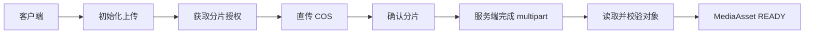

# 打卡与媒体

## 定位

阶段 5 将任务分配与协作周期连接到可提交的打卡聚合，并为图片和视频提供家庭隔离的腾讯云 COS multipart 上传流程。领域实现位于 `apps/api/src/check-ins/` 和 `apps/api/src/media/`。

## 内容规则

| 打卡方式 | 内容要求 |
|---|---|
| `CHECKBOX` | 不携带文字或媒体 |
| `TEXT` | 必须包含非空文字，不携带媒体 |
| `PHOTO` | 包含 1 至 9 张 `READY` 图片 |
| `VIDEO` | 包含 1 个 `READY` 视频 |
| `MIXED` | 文字、最多 9 张图片和最多 1 个视频至少提供一种 |

视频最长 180 秒且不超过 100MB。图片上限为 25MB。媒体必须属于当前家庭、处于 `READY` 状态并与声明类型一致；音频上传当前被拒绝。

## 单人打卡

孩子会话通过任务分配提交打卡。服务按家庭 IANA 时区确定自然日、截止时刻和补打窗口，并再次校验任务频率是否覆盖目标日期。当天在截止时刻前可提交，过去日期仅在配置的补打天数内可提交。

验收方式为 `AUTO` 时，新提交进入 `APPROVED`；`MANUAL` 时进入 `PENDING`。同一分配和日期保留一个当前聚合，`PENDING` 或 `APPROVED` 阻止新提交，`REJECTED` 允许重提。每次提交写入独立 `CheckInSubmissionAttempt`，保存内容、媒体顺序、前次审核状态、审核人、审核时间和意见快照。

## 协作打卡

协作周期使用调度时固化的参与者快照。每个参与孩子独立提交并维护自己的最新状态与 attempt 历史，读取接口返回该周期全部参与者提交进度。已通过参与者保持 `APPROVED`；任务 6.1 已接入家长审核，周期统一完成及积分发放由后续任务接续处理。

## 幂等与并发

单人提交、协作提交和媒体初始化均要求家庭范围 `Idempotency-Key`。重复键返回既有结果；同一业务目标使用新键重复提交时返回冲突。数据库唯一键保护提交业务键、attempt number、上传会话键和分片编号。

家长审核的状态转换、attempt 级历史和并发保护见 `SubmissionReviews.md`。

## COS 上传流程

服务从当前家庭 `VERIFIED` COS 配置中读取 Bucket 和 Region，并仅在单次请求内通过 `CredentialVault` 解密 SecretId 与 SecretKey。COS 客户端使用 V5 请求签名，SecretKey 不进入 URL、响应或持久化上传状态。

上传会话和各分片持久化到 PostgreSQL，服务重启后可继续授权和确认。初始化时校验视频声明时长，完成操作按分片编号提交 ETag，随后从 COS 读取对象并校验 MIME、文件签名、大小和 SHA-256。失败会话保存稳定失败码，可通过 retry 恢复到上传状态。

## 私有读取

对象键使用不可预测 UUID 并保存在数据库。访问接口校验有效会话、家庭所有权、活动记录和 `READY` 状态后，生成短期签名 GET URL。业务响应不暴露 COS 永久凭证。

## 验证边界

阶段 5 使用状态型内存仓储组合真实领域服务和 Hono 路由，覆盖内容边界、补打日期、重复提交、重提历史、协作参与者状态和服务端对象验证。阶段 11 扩展 COS 中止 multipart 和删除对象能力，404 按幂等成功处理；Worker 按小时清理过期上传并软删除媒体资产。真实 PostgreSQL 事务竞争、Redis 服务端和腾讯云 COS 运行态由阶段 12 验证。
