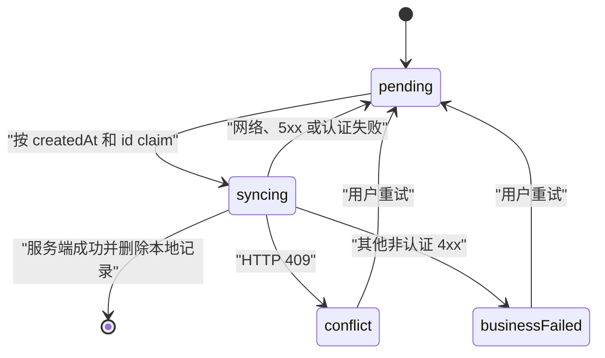

# PWA 离线打卡同步

## 目标与范围

阶段 12 为孩子端单人打卡提供可安装应用壳和设备内恢复队列。TICK/TEXT 保存可自动重放的请求；PHOTO/VIDEO/MIXED 保存需用户确认的本地媒体草稿。协作周期提交继续使用在线入口。

## 应用壳与缓存边界

Service Worker 仅在 production、安全上下文且浏览器支持时注册为作用域 `/` 的 module worker。安装阶段预缓存 `/`、`/offline`、manifest 和两枚图标；激活阶段只清理 `familystar-pwa-` 前缀的旧版本缓存。

| 请求类别 | 策略 | 边界 |
|---|---|---|
| 页面导航 | network-first | 网络失败返回缓存的 `/offline` |
| `/_next/static/` | cache-first | 使用去凭据的公开缓存键 |
| 同源公开静态资源 | stale-while-revalidate | 命中后后台刷新 |
| API、auth、private、跨源、授权、非 GET | bypass | 始终交给网络 |

缓存键仅保留 `Accept`，并设置 `credentials: "omit"`。仅缓存同源、成功、状态 200、非重定向、非 opaque 的响应；`Cache-Control: private/no-store`、`Set-Cookie` 和 `Vary: *` 均排除。

## IndexedDB v2

数据库名为 `familystar-offline`，版本为 2。

| Store | 主键与索引 | 主要内容 |
|---|---|---|
| `check-in-queue` | keyPath `id`；唯一 `intentId`；`createdAt`、`status` | assignment、日期、TICK/TEXT 内容、原始幂等键、owner、状态、attempt、租约与失败详情 |
| `media-drafts` | keyPath `id`；`intentId`、`createdAt`、`status`、`taskId`、`queueId` | Blob、MIME、大小、上传键、打卡键、owner、已上传媒体 ID 与失败详情 |

媒体仅接受 JPEG、PNG、WebP、MP4、QuickTime 和 M4V。图片单文件最多 25MB，视频单文件最多 100MB，设备内媒体草稿合计最多 10 个文件和 200MB。类型、大小、总量及可选 queue 关联在同一写事务中校验；容量和事务错误映射为可读本地错误。

## Owner 隔离

owner 只包含 `familyId` 和 `childId`，来源为在线验证成功的孩子 session，并以 `familystar_offline_owner_scope_v2` 保存到 localStorage。列表展示、claim、重试、删除、媒体状态更新和确认上传均校验两个字段。

离线启动时可使用已保存 owner 展示当前孩子的设备草稿。自动重放还要求本次在线 session 验证成功。父级 session、畸形 owner 和 v1 无 owner 记录保持隔离，无法由当前身份读取或恢复。

## 普通队列状态机

每个 runner 使用 30 秒 owner lease，页面内并发 `run()` 合并为同一 Promise。网络和 5xx 失败记录 attempt 并采用最高 5 分钟的指数退避；401/403 同时暂停当前 runner，等待身份重新验证。409 保存服务端权威 details 并停止自动重试，其余非认证 4xx 保存为业务失败。稳定排序的队首终态会阻塞后续记录，确保用户先处理顺序冲突。

## 幂等与媒体确认

一个 `CheckInIntent` 在首次操作时生成 intent ID、打卡幂等键和逐文件上传幂等键。离线保存与恢复沿用这些原值；重复保存同一 intent 返回既有记录。

媒体草稿初始为 `awaiting-confirmation`。用户点击“确认上传”后，同一 intent 的文件按 `createdAt + id` 顺序上传；每个成功的媒体 ID 立即写回 IndexedDB。中断后再次确认会跳过已有媒体 ID 并复用稳定上传键，全部就绪后使用原打卡键提交 `/check-ins`。成功后删除该 intent 的本地草稿；409 和其他 4xx 分别进入 conflict、business-failed，网络类错误回到 awaiting-confirmation。

## 装配与验证

Web Docker target 除 standalone 与 `.next/static` 外，还显式复制 `apps/web/public`，保证 Service Worker、策略模块和图标进入生产镜像。容器契约测试固定此装配要求。

| 事实提交 | 验证范围 |
|---|---|
| `23e7ed4` | manifest、图标、注册、离线页、缓存策略与运行时 |
| `4cececb` | Web 镜像 public 资产装配及容器契约 |
| `d175b2e` | IndexedDB v2、TICK/TEXT 队列、媒体 Blob 草稿 |
| `f4a1b31` | 顺序重放、租约、owner、状态界面、媒体确认上传 |
| `8158e08` | 缓存边界、旧记录隔离、409/5xx/退避和恢复边界强化 |

最终 `i56-web` 已通过真实 Chromium 验证。
