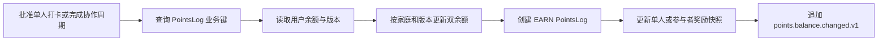

# 积分账本

## 定位

任务 6.3 在 `apps/api/src/points/` 建立积分账本与单人打卡积分事务，任务 6.4 接入家庭动态 Streak 和协作周期统一发分。积分账本以 `PointsLog` 保存不可变变动，以 `User` 保存当前余额、累计获得积分和乐观锁版本，并通过 Outbox 发布余额及协作完成事件。

## 发放入口

| 入口 | 条件 | actor |
|---|---|---|
| 单人 AUTO 提交 | 新状态为 `APPROVED` | 孩子 |
| 家长审核 | 单人决策为 `APPROVED` | 家长 |
| 超时审核 | 单人自动决策为 `APPROVED` | null |
| 协作 AUTO 提交 | 本次通过后全部活动参与者均为 `APPROVED` | 孩子 |
| 协作家长审核 | 本次通过后全部活动参与者均为 `APPROVED` | 家长 |
| 协作超时审核 | 本次通过后全部活动参与者均为 `APPROVED` | null |

`REJECTED` 不发放积分。协作中任一活动参与者仍未通过时，周期保持未完成且不执行统一发分。

单人基础积分为 `TaskAssignment.customPoints ?? Task.basePoints`，协作基础积分取调度时固化的 `CollaborationRoundParticipant.rewardPointsSnapshot`。实得积分与倍率分别保存到 `CheckIn` 或活动参与者的 `pointsEarned`、`streakMultiplier`。

## Streak 规则

`calculateStreakAward()` 接收奖励日期、历史活动日期和规范化家庭设置中的固定六档倍率。writer 查询截至奖励日的已通过单人打卡日期与已完成协作周期结束日期，再按以下规则计算：

1. 当前奖励日期始终计入活动日期。
2. 同一家庭自然日通过 `Set` 去重，单人和协作同日活动只计一天。
3. 从奖励日期逐个自然日向前检查，遇到首个断档即停止。
4. 在 3、7、14、30、60、100 天六档中选择已达到的最高档；未达到首档时倍率为 1。
5. 实得积分使用 `Math.round(basePoints * multiplier)`，随后再次校验 PostgreSQL `Int` 范围。

## 事务边界

`PointsTransactionWriter.run()` 接收业务状态回调，并向回调提供 `PointsAwardPort`。AUTO 提交、人工审核和超时审核由该 writer 启动 `Serializable` Prisma 事务，因此状态、审核历史、周期完成、用户余额、积分流水、奖励快照和 Outbox 共享同一 transaction client。

任何一步失败均抛出事务回调，由 Prisma 回滚本次状态和积分写入。

## 双余额规则

- `pointsBalance` 表示可用当前余额。
- `pointsEarnedTotal` 表示历史累计获得积分。
- EARN delta 必须为正，并同时增加两个字段。
- REDEEM delta 为负，仅减少当前余额，并禁止产生负余额。
- REFUND delta 为正，仅恢复当前余额。
- 正向 MANUAL 同时增加累计获得积分，负向 MANUAL 仅影响当前余额。
- 所有输入和结果必须为安全整数，并位于 PostgreSQL `Int` 范围内。

## 幂等与并发

单人打卡业务键固定为 `(type = EARN, businessType = check_in, businessId = checkInId, userId = childId)`；协作周期业务键固定为 `(type = EARN, businessType = collaboration_round, businessId = roundId, userId = childId)`。

1. 事务先查询业务键，存在时直接返回既有流水。
2. 用户更新条件包含 `id`、`familyId`、`version` 和 `deletedAt = null`，成功时同步递增版本。
3. 版本未命中会回滚完整事务并重新读取，最多尝试 3 次。
4. `PointsLog.create()` 的 P2002 会结束当前失败事务；writer 在事务外确认既有流水后重放业务回调。
5. 三次持续竞争产生带 `CONFLICT` 和 `retryable = true` 的 `PointsTransactionConflictError`。

数据库同时使用流水业务唯一键、余额非负、余额守恒和 delta 方向 CHECK 约束提供最终保护。

协作完成先读取周期、活动参与者和提交状态，确认全员 `APPROVED` 后条件更新周期为 `COMPLETED`。writer 随后写入 `check-in.collaboration.completed.v1`，并逐个活动参与者按奖励快照调用同一 EARN 流程；完成状态、完成事件、每个孩子的余额事件、流水和参与者快照均在同一事务内原子提交。已完成周期或既有参与者业务键使重试安全收敛。

## 余额事件

成功发放追加 `points.balance.changed.v1`，payload 包含 `user_id`、业务类型、业务 ID、delta、变更后余额和累计积分。协作完成事件 `check-in.collaboration.completed.v1` 包含 `round_id` 和活动参与者数量。事件不保存昵称、提交内容、凭据或其他敏感数据。

## 验证

纯规则测试覆盖 EARN、REDEEM、REFUND、负余额、方向、整数溢出、最高 Streak 档、同日去重、断档停止和 `Math.round`。Prisma writer 测试覆盖双余额、流水和快照、既有流水幂等、三次版本冲突、序列化冲突重放、P2002 回滚后确认与重放、Outbox 回滚、协作全员通过发分及未全员通过保持开放。打卡和审核仓储测试覆盖 AUTO、家长、超时三条单人及协作路径。任务 6.6 额外覆盖 25 个重复业务键、0 至 2 次乐观冲突后成功、1 至 120 天 Streak 档位和 250 组 EARN 双余额不变量。

阶段 6 完成时全仓 56 个测试文件、345 个测试全部通过；整体 statements 与 lines 为 80.13%、branches 为 81.04%、functions 为 92.41%，积分目录 statements 与 lines 为 96.81%、branches 为 86.45%、functions 为 100%。真实 PostgreSQL 并发竞争与 CHECK 运行态验证保留至任务 11。
