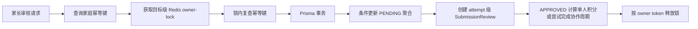

# 提交审核

## 定位

任务 6.1 为单人打卡与协作提交接入家长人工审核，任务 6.2 增加按家庭规则执行的超时自动通过，任务 6.3 将单人 `APPROVED` 状态与积分发放纳入同一事务，任务 6.4 在单人和协作审核通过路径接入动态 Streak，并在协作全员通过时统一发分。任务 14 补齐家庭待审队列和家长端权威刷新闭环。实现位于 `apps/api/src/check-ins/review-*` 与 `apps/web/components/parent-portal.tsx`，覆盖队列读取、审核决策、历史查询、家庭隔离、有界候选批次、幂等重试和并发保护。

## 审核目标

| 目标类型 | 当前聚合 | 历史关联 |
|---|---|---|
| `CHECK_IN` | `CheckIn` | 最新 `CheckInSubmissionAttempt` |
| `COLLABORATION_SUBMISSION` | `CollaborationSubmission` | 最新 `CollaborationSubmissionAttempt` |

每次审核只接受 `APPROVED` 或 `REJECTED`。拒绝原因在领域层去除首尾空白后必须非空，HTTP 层将 reason 长度限制为 2000 字符。

## 待审队列

`listPendingReviews()` 分别读取当前家庭仍为 `PENDING` 的单人打卡和协作提交。聚合状态是待审资格的唯一依据，latest attempt 只提供内容、媒体和提交时间快照。Prisma 查询同时限定家庭、活动任务、活动孩子和未软删除目标；两类结果合并后按提交时间、目标类型和目标 ID 稳定排序，最多返回 100 条。

队列记录提供目标与 attempt ID、任务与孩子摘要、可空文字、媒体 ID/类型以及提交时间。媒体访问继续通过同家庭 `GET /api/v1/media/:id/access-url` 获取短期 URL。

家长 Web 页面为每个 attempt 和决定生成 `review:<attemptId>:<APPROVED|REJECTED>` 幂等键。审核 POST 成功后立即重新 GET 权威队列；POST 失败保留记录，POST 成功但队列刷新失败时保留可见记录并提示用户重新确认。

## 权限与家庭边界

审核写入和历史查询均从 `familystar_session` Cookie 读取会话。服务要求角色为 `parent`，并从会话注入 `familyId` 和审核人 ID。Prisma 查询和条件更新同时限定家庭 ID，其他家庭的目标对当前调用方不可见。

## 写入流程

目标锁 TTL 为 10 秒，键由 `reviewLock(targetType, targetId)` 构造。锁释放使用比较 owner token 的 Lua 原子操作。人工请求的锁竞争、目标状态竞争和冲突幂等键形成 `409 CONFLICT`；自动审核遇到相同竞争时安全跳过。

## 超时自动通过

`SubmissionReviewTimeoutService.runBatch()` 每次只读取一次有限候选批次。候选覆盖单人打卡与协作提交，并携带最新 attempt 的 `submittedAt` 和所属家庭设置。服务通过 `normalizeFamilySettings()` 取得每条记录自己的 `reviewTimeoutHours`：值为 0 时保持人工审核，缺失或损坏配置回退为 48 小时，到期边界为 `submittedAt + timeout <= now`。

每条到期候选使用与家长审核相同的目标锁，幂等键固定为 `timeout:<targetType>:<attemptId>`。Prisma 事务再次确认候选 attempt 仍为最新 attempt，只对 `PENDING` 聚合执行 `APPROVED` 条件更新，并创建 `TIMEOUT` 历史。家长抢先审核、重提、重复批次、锁竞争和唯一冲突均返回跳过。独立 Worker 按分钟运行键周期调用该单批执行器。

单人打卡通过时，审核事务按 assignment 覆盖或任务基础积分调用共享积分端口；协作提交通过时调用 `completeCollaborationRound()`，并在全部活动参与者均为 `APPROVED` 后按各自奖励快照统一发分。家长审核使用家长作为事件 actor，超时审核使用空 actor。积分 writer 在相同 transaction client 内完成动态 Streak、周期状态、双余额、流水、单人或参与者快照以及 Outbox。

## 幂等语义

审核请求必须携带最长 128 字符的 `Idempotency-Key`。服务在获取锁前后各查询一次 `(family_id, idempotency_key)`：

- 同一键指向同一目标时返回既有审核记录。
- 同一键指向另一目标时返回冲突。
- 数据库唯一冲突发生后，仓储重新查询既有记录并执行相同目标判定。

Redis 锁缩小并发窗口，Prisma 的条件更新、attempt 唯一键和家庭幂等唯一键提供最终一致性保护。

## 历史模型

`SubmissionReview` 保存 `targetType`、二选一 attempt 外键、家庭幂等键、决策、`PARENT | TIMEOUT` 来源、原因、可空审核人、审核时间和创建时间。人工审核写入 `PARENT` 与家长 ID，超时审核写入 `TIMEOUT` 与空审核人。历史查询通过 attempt 反向关联到打卡或协作提交，并按 `reviewedAt` 升序返回。

SQL 迁移提供两项核心保护：

- `submission_reviews_target_check` 保证目标类型与单人/协作 attempt 外键严格对应。
- `submission_reviews_rejection_reason_check` 保证拒绝决策具有去除空白后非空的原因。
- `submission_reviews_source_reviewer_check` 保证人工来源具有审核人，并保证超时来源没有审核人。

## HTTP 接口

| 方法与路径 | 用途 |
|---|---|
| `GET /api/v1/family/submission-reviews/pending` | 读取当前家庭待审队列 |
| `POST /api/v1/check-ins/:id/reviews` | 审核单人打卡 |
| `GET /api/v1/check-ins/:id/reviews` | 读取单人打卡审核历史 |
| `POST /api/v1/collaboration-submissions/:id/reviews` | 审核协作提交 |
| `GET /api/v1/collaboration-submissions/:id/reviews` | 读取协作提交审核历史 |

响应使用统一 API 信封和 snake_case 审核字段，成功请求续期当前会话 Cookie。详细字段和错误映射见 `../INTERFACES.md`。

## 当前边界

阶段 6 覆盖家长人工审核、超时自动通过、统一历史、动态 Streak、单人/协作通过后的积分事务、等级派生与权益读取，以及核心属性与竞态测试；阶段 11 将超时批处理接入独立 Worker；任务 14 将家庭待审聚合接入家长页面。孩子今日任务聚合仍显示受限状态。

## 验证

领域测试覆盖家长权限、家庭隔离、空队列、拒绝原因、幂等重试、48 小时边界、0 禁用、家庭级超时、批次上限、目标锁与重复执行。Prisma 仓储测试覆盖两种目标的待审合并、latest attempt 复查、条件更新、`TIMEOUT` 历史、家长并发竞争，以及单人/协作的家长与超时发分衔接；HTTP 测试覆盖队列、人工与超时历史输出。Playwright 覆盖审核成功后的权威重拉、浏览器重新挂载、稳定幂等键和失败记录保留。任务 14 完成时全仓单元测试为 77 个文件、496 项，浏览器回归为 8 项。
