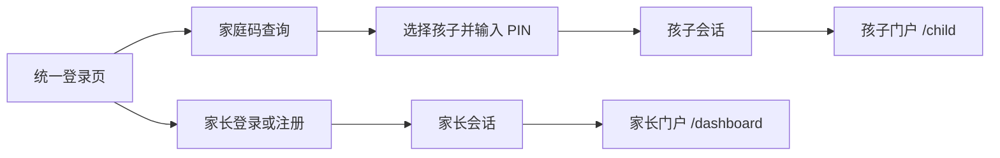

# 统一家庭登录入口技术设计

Feature Name: unified-family-login
Updated: 2026-08-01

## Description

将当前视觉基础展示页替换为可操作的统一登录页，并扩展现有家庭认证服务，使未认证孩子可以通过家庭码定位家庭、选择本人档案并完成 PIN 登录。现有家长认证、孩子凭据校验、锁定、限流和 Redis 会话实现继续复用。

## Architecture

根路径使用客户端登录组件管理身份切换、提交状态与跳转。所有请求继续使用同源 `/api/v1`，由 Next.js rewrite 转发到 Hono API。API 通过 Prisma 读取家庭和孩子，通过现有 bcrypt、Redis 限流器和会话存储完成认证。

## Components and Interfaces

### Web

- `app/page.tsx`：渲染统一登录组件。
- `components/auth-landing.tsx`：身份切换、家长登录/注册、家庭码查找、孩子选择、PIN 登录、错误和加载状态。
- `lib/auth.ts`：统一认证 API 请求、响应类型和错误映射。
- `components/parent-portal.tsx`：家庭成员页读取会话信息并展示家庭码。

### API

- `GET /api/v1/auth/session`：读取 Cookie；有效时返回角色、主体、家庭和家庭码，无效时返回 401。
- `POST /api/v1/auth/child/family`：接收 `{ family_code }`，返回 `{ family, children }`。
- `POST /api/v1/auth/child/login`：接收 `{ family_code, child_id, credential }`，验证家庭与孩子后设置会话 Cookie。
- 现有 `POST /api/v1/auth/parent/login` 与 `POST /api/v1/auth/parent/register` 保持请求契约。

### Domain and Repository

- `FamilyAuthRepository` 创建家庭时保存家庭码，并支持按家庭 ID 读取家庭码。
- `ChildAccountRepository` 支持按规范化家庭码解析活动家庭，并继续按 `familyId + childId` 读取孩子。
- `ChildAccountService` 将家庭码解析结果传入现有凭据验证、失败计数、锁定和会话创建流程。

## Data Models

`Family` 新增字段：

| 字段 | 类型 | 约束 |
|---|---|---|
| `familyCode` | `String` | `@unique`、6 位数字、数据库列 `family_code` |

新家庭使用加密随机源生成 `000000` 至 `999999` 的 6 位数字码。数据库唯一索引提供最终冲突保护，创建服务在唯一冲突后重新生成。

升级迁移删除原 10 位格式约束，为所有现有家庭分配新的唯一 6 位数字码，将列收紧为 `VARCHAR(6)`，再增加 `^[0-9]{6}$` CHECK。迁移在家庭总数超过 100 万时终止，防止家庭码空间重复。迁移完成后旧家庭码立即失效。

## Correctness Properties

1. 每个活动家庭拥有且仅拥有一个家庭码。
2. 家庭码解析只产生一个家庭 ID。
3. 孩子登录的 `childId` 必须属于家庭码解析出的家庭。
4. 成功孩子登录清零失败次数并创建 `role=child` 会话。
5. 失败孩子登录沿用乐观版本更新，避免并发失败计数丢失。
6. 根路径只根据服务端有效会话角色跳转。
7. 每个持久化家庭码匹配 `^[0-9]{6}$`。

## Error Handling

- 家庭码格式错误返回 `400 INVALID_REQUEST`。
- 家庭码无匹配返回 `401 UNAUTHORIZED`，消息不披露家庭存在性细节。
- 孩子或 PIN 不匹配返回 `401 UNAUTHORIZED`。
- 锁定返回 `401 UNAUTHORIZED` 和 `remaining_seconds`。
- 限流返回 `429 RATE_LIMITED` 和 `retry_after_seconds`。
- Web 将网络失败、字段错误、认证失败、锁定和限流映射为中文状态消息。

## Test Strategy

- 单元测试覆盖 6 位数字家庭码格式、生成器和服务层家庭解析。
- Prisma 契约测试覆盖 `VARCHAR(6)` 字段、唯一索引、迁移替换和格式约束。
- HTTP 测试覆盖会话读取、家庭查询、孩子登录 Cookie、无效家庭码、锁定和限流。
- Web 组件测试覆盖身份切换、家长登录/注册、孩子两步登录、错误状态和已有会话跳转。
- 运行 `pnpm quality` 验证格式、Lint、类型、Prisma、覆盖率、构建、设计系统、API 契约与 Playwright。

## References

[^1]: `apps/api/src/family-auth/service.ts` - 家长注册与登录服务。
[^2]: `apps/api/src/family-auth/child-service.ts` - 孩子凭据、锁定、限流与会话服务。
[^3]: `apps/api/src/family-auth/child-routes.ts` - 孩子账号 HTTP 路由。
[^4]: `apps/web/app/page.tsx` - 当前根路径视觉基础页。
[^5]: `.monkeycode/docs/专有概念/Authentication.md` - 已有认证边界。
