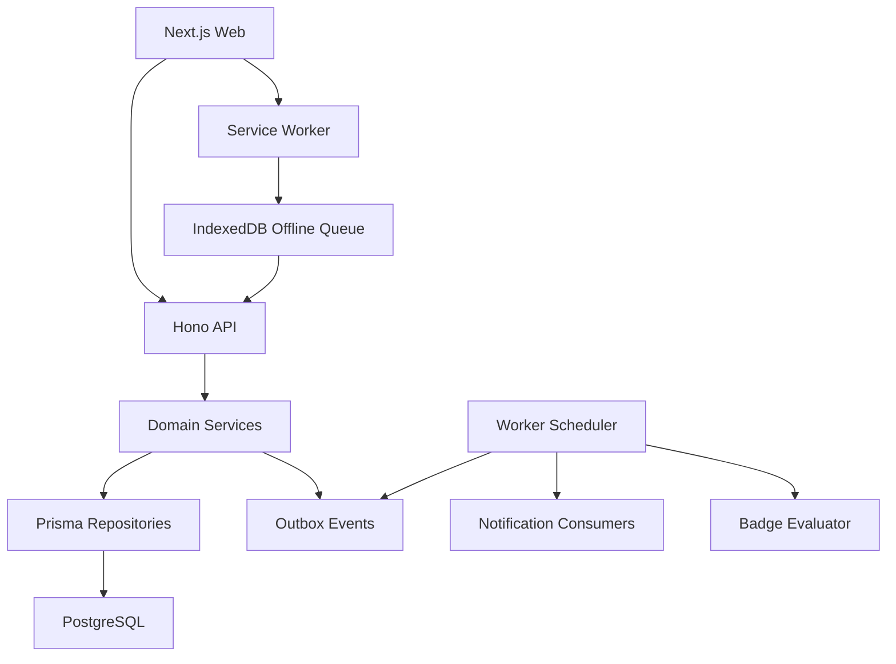

# FamilyStar 产品功能补全技术设计

Feature Name: product-completion
Updated: 2026-08-06

## Description

本设计在现有 Next.js、Hono、Prisma、Redis、Worker、Outbox 和 Docker 双环境基础上补齐产品能力。实现沿用小型领域服务、仓储端口、Hono 路由、家庭与角色边界、统一响应信封、React 页面资源状态和稳定幂等键模式。

完整成长报告、开放 API、访客角色和多家庭平台化保留为未来范围。

## Architecture

API 继续作为唯一业务授权边界。Web 仅保存界面状态、离线请求草稿和非敏感主题选择缓存；所有家庭、积分、徽章、通知和模块状态以服务端为权威。

## Components and Interfaces

### Query Foundation

- 新增通用 cursor 分页解析器，以 `(created_at, id)` 或领域稳定排序键生成不透明 cursor。
- 集合响应在 `data.page` 返回 `next_cursor` 和 `has_more`，保留现有顶层 `meta`。
- 所有新增受保护路由在安全权限矩阵中显式登记角色。

### Family Read Model

- `GET /api/v1/family/profile`：家庭名称、时区、家长和当前邀请摘要。
- `PATCH /api/v1/family/profile`：创建者维护名称，双家长维护允许的家庭规则字段。
- `GET /api/v1/family/parents`：活动家长和邀请状态。
- `POST /api/v1/family/invitations/:id/resend` 与 `DELETE /api/v1/family/invitations/:id`：创建者管理待处理邀请。

### Dashboard and Analytics

- `GET /api/v1/family/dashboard?date=`：孩子今日进度、待办计数与目标 URL，以及最多三十条按 `(occurred_at, id)` 倒序排列的近期动态。
- 近期动态直接聚合打卡、审核、积分、等级、兑换、愿望、成员、邀请和徽章业务记录；Outbox 投递状态不参与总览业务判断。
- `GET /api/v1/family/analytics`：孩子、任务、日期范围筛选后的打卡率、积分趋势、任务表现和等级分布。
- `GET /api/v1/rankings?family_scope=&metric=&period=`：家庭内余额、累计积分、等级排行。
- 聚合统一以家庭时区计算自然日边界，并限制最大日期跨度。

### Points and History

- `GET /api/v1/points/me` 与 `GET /api/v1/points/me/logs`：孩子余额和分页流水。
- `GET /api/v1/family/children/:id/points`：家长查看指定孩子积分视图。
- `GET /api/v1/check-ins/me/history` 与 `GET /api/v1/family/check-ins/history`：角色范围历史。
- `POST /api/v1/media/access-urls`：一次最多为限定数量的同家庭 READY 媒体生成访问地址。

### Growth Records

- 新增 `GrowthRecord` 与 `GrowthRecordMedia`，支持 CHECK_IN、NOTE 和 MILESTONE 类型。
- 已通过打卡通过 Outbox 消费者幂等写入记录快照；学习笔记由家长 CRUD。
- 快照保存标题、正文、发生日期、孩子、来源类型和来源 ID，任务归档后仍可回看。

### Task and Reward Management

- 复用现有任务类型、任务状态、孩子 CRUD、奖励 CRUD、兑换和愿望端点。
- 扩展任务 PATCH 支持受约束的 assignments、模式和提交指南更新。
- Web 增加任务类型管理、任务状态操作、完整奖励编辑、兑换拒绝、愿望采纳和孩子档案编辑。
- 所有删除操作使用现有软删除或终态转换，并提供确认步骤。

### Badge Domain

- 新增 `BadgeTemplate`、`BadgeAward` 和可选 `BadgeProgress`。
- 模板条件使用受控判别联合：任务完成次数、连续天数、累计积分、等级、协作次数和手动颁发。
- 业务事件消费者按家庭启用模板计算进度，以 `(template_id, child_id, level)` 唯一键保证颁发幂等。
- 颁发记录保存模板展示快照，保护历史真实性。
- 家庭注册初始化首个任务、累计七次任务、连续七天、累计一百分、达到三级和首次协作六个启用模板；迁移为既有活动家庭幂等回填。
- 自动颁发与 `badges.award.created.v1` 在同一事务写入，颁发 ID 同时作为 Outbox 事件 ID，保证源事件重投只产生一个颁发事件。
- 徽章后端在家庭总览阶段前置完成模板管理、手动颁发、孩子徽章墙和事件评估；管理与徽章墙 Web 页面继续由任务 8.4 实现。

### Notification Domain

- 新增 `Notification` 与 `NotificationPreference`。
- Outbox 消费者将审核、积分、升级、兑换、愿望、徽章和邀请事件转换为接收者通知。
- Web Shell 通知按钮打开通知中心，支持未读角标、已读操作和目标跳转。
- Worker 每日清理超过九十天的通知。

### PWA

- Next.js 提供 Web App Manifest、应用图标和 Service Worker 注册。
- 安装入口关闭时写入 `familystar_install_prompt_dismissed=1` Cookie，使用 `Max-Age=259200`、`Path=/` 和 `SameSite=Lax`，安全上下文同时设置 `Secure`。
- `beforeinstallprompt` 处理器在展示入口前读取抑制 Cookie；Cookie 有效期间只保留浏览器原生安装事件的默认抑制行为。
- `display-mode: standalone` 与 iOS `navigator.standalone` 共同识别移动设备桌面应用入口，独立运行上下文保持安装入口隐藏。
- Service Worker 缓存版本化应用壳和静态资源，导航失败时返回离线页面。
- IndexedDB 保存 TICK/TEXT 离线请求的 URL、请求体、幂等键、创建时间和状态。
- 恢复网络后按创建时间顺序重放；媒体文件只保存本地草稿元数据和 Blob，恢复后由用户确认上传。

### Module Settings and Themes

- `Family.settings.modules` 保存可选模块布尔值，核心任务、积分和认证模块保持启用。
- API 中间件依据家庭模块设置保护可选路由，Web 根据同一读取模型过滤导航。
- `User.preferences.theme` 保存孩子主题 ID。
- 主题目录由代码静态定义，解锁规则来自等级；服务端验证后保存选择，Web 将主题映射为 CSS variables。

## Data Models

### GrowthRecord

- `id`, `familyId`, `childId`, `type`, `title`, `contentText`, `occurredOn`
- `sourceType`, `sourceId`, `createdById`, `createdAt`, `updatedAt`, `deletedAt`
- 唯一来源键保护自动写入幂等。

### BadgeTemplate and BadgeAward

- 模板保存家庭、名称、描述、图标、类别、条件 JSON、可见性、启用状态和版本。
- 颁发保存孩子、模板、模板展示快照、等级、原因、来源事件和颁发时间。

### Notification and Preference

- 通知保存接收者、类型、标题、正文、目标 URL、关联 ID、已读时间和创建时间。
- 偏好保存用户、站内开关、浏览器开关、类型开关和免打扰起止时间。

### Existing JSON Preferences

- `Family.settings.modules` 保存家庭可选模块状态。
- `User.preferences.theme` 保存孩子主题选择。

## Correctness Properties

1. 所有查询和写入从认证会话取得 `familyId`，客户端家庭 ID 只用于一致性校验。
2. 分页结果在相同数据快照和 cursor 下保持稳定顺序。
3. 聚合日期边界按目标家庭 IANA 时区计算。
4. 积分余额、累计获得积分和流水继续在同一事务保持守恒。
5. 同一业务事件只产生一条相同接收者和模板的通知或徽章颁发结果。
6. 历史成长记录保存快照，来源任务或模板后续变化不修改历史展示。
7. 关闭可选模块不删除业务数据，重新启用后恢复服务端权威数据。
8. 离线请求重放复用原幂等键，冲突时停止自动重试并展示权威状态。
9. 安装入口抑制 Cookie 的有效期固定为 259200 秒，独立显示模式的识别优先于安装事件展示。

## Error Handling

- 无效 cursor、日期、筛选和枚举返回 `400 INVALID_REQUEST`。
- 角色权限和家庭边界分别返回现有 `401`、`403` 或资源范围内 `404`。
- 写入竞态、版本冲突和幂等指纹冲突返回 `409 CONFLICT`。
- 模块关闭返回稳定业务错误并由 Web 映射为能力关闭状态。
- 统计查询限制日期跨度和分页上限，超限返回输入错误。
- 离线队列记录网络错误、业务错误和冲突三类状态，避免无限重放。
- 浏览器限制 Cookie 写入时，安装入口在当前页面会话立即关闭，后续页面根据浏览器实际持久化状态重新判断。

## Test Strategy

- 每个领域增加纯规则、服务、路由和 Prisma 仓储测试。
- 聚合测试覆盖家庭时区、空集合、分页边界、家庭隔离和并发写入。
- 徽章与通知测试覆盖事件重投、幂等、条件边界和历史快照。
- Web helper 测试覆盖 payload、状态映射、排行、愿望槽位、模块和主题规则。
- 组件与 Playwright 覆盖家长九页、孩子六页、完整 CRUD、错误恢复和移动视口。
- PWA 测试覆盖 manifest、安装入口抑制 Cookie、独立显示模式、离线导航、队列重放、幂等冲突和媒体草稿恢复。
- 迁移通过 Prisma validate、迁移部署、数据库约束和回滚备份验证。
- `8098` 与生产构建 HTTPS `8099` 均使用隔离家庭完成 14 项家长与孩子真实浏览器验收。

## 验收追溯矩阵

| 需求 | 主要自动化证据 | 正确性属性 |
|---|---|---|
| 2 家庭总览 | `dashboard-badges.real.spec.cjs`、`dual-portals-navigation.real.spec.cjs` | 1、3、5 |
| 3 积分、统计与排行 | `analytics-rankings.real.spec.cjs`、`points-read-model.real.spec.cjs` | 1、2、3、4 |
| 4 历史与成长记录 | `history-media-access.real.spec.cjs`、`growth-records.real.spec.cjs` | 1、2、3、6 |
| 5 家庭与成员管理 | `family-management.real.spec.cjs`、`child-profile-management.real.spec.cjs` | 1、3 |
| 6 任务管理 | `task-management.real.spec.cjs` | 1、3、6 |
| 7 审核体验 | `submission-reviews.real.spec.cjs` | 1、2、5、6 |
| 8 奖励、兑换与愿望 | `reward-management.real.spec.cjs` | 1、4、6、7 |
| 9 徽章 | `dashboard-badges.real.spec.cjs` | 1、5、6 |
| 10 通知 | `notifications-modules.real.spec.cjs` | 1、2、5 |
| 11 PWA 与离线 | `offline-check-ins.real.spec.cjs`、`themes-pwa.real.spec.cjs` | 8 |
| 12 模块与主题 | `notifications-modules.real.spec.cjs`、`themes-pwa.real.spec.cjs` | 1、7 |
| 13 质量与发布 | 普通 Playwright 23 项、双环境真实 E2E 各 14 项、`ops/release-scripts.test.ts` | 1 至 8 |

## References

- `.monkeycode/specs/decisions.md`
- `.monkeycode/specs/phase-1-mvp/tasklist.md`
- `.monkeycode/specs/2026-08-05-collaboration-check-in-loop/`
- `design/familystar_design_v5/PRD_Latest.html`
- `.monkeycode/docs/ARCHITECTURE.md`
- `.monkeycode/docs/INTERFACES.md`
